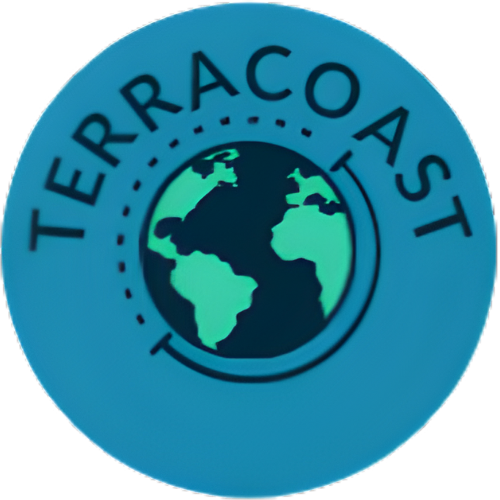

# TerraCoast 🌍  
*Apprends la géographie de manière ludique, sociale et gratuite.*
<p align="center">
  
</p>

## À propos du projet

TerraCoast est une plateforme interactive dédiée aux passionnés de géographie et aux curieux souhaitant apprendre en s’amusant.  
Le projet est né de la rencontre entre deux étudiants en informatique : l’un passionné par le développement web, l’autre par la géographie. Ensemble, nous avons voulu créer une expérience moderne, gratuite et sans publicité.

### Notre vision

Nous croyons que la connaissance géographique doit être **accessible à tous**, sans abonnement ni contrainte. TerraCoast te permet non seulement de tester tes connaissances, mais aussi de créer et partager tes propres quiz avec la communauté.

### Fonctionnalités principales

- **Architecture moderne** : React + TypeScript + Supabase  
- **Base de données sécurisée** grâce au système RLS (Row Level Security)  
- **Fonctionnalités sociales** : chat en temps réel, liste d’amis, duels multijoueurs  
- **Gamification complète** : niveaux, XP, badges, titres et classement mensuel  
- **Mode créateur** : crée, modifie et partage tes propres quiz  

Le projet évolue continuellement grâce aux retours de la communauté.  
Chaque quiz, duel ou suggestion contribue à rendre TerraCoast toujours plus engageant.

## Lien du site

👉 [Découvre TerraCoast](https://TerraCoast.ch)

## Démarrage du projet

### Prérequis

Assure-toi d’avoir installé sur ta machine :
- Node.js (version 18 ou supérieure)
- npm ou yarn

### Installation

Clone le projet :

```bash
git clone https://github.com/Fullann/TerraCoast-V2.git
cd erraCoast-V2
```

Installe les dépendances :

```bash
npm install
```

### Configuration de l’environnement

Crée un fichier `.env` à la racine du projet et ajoute tes clés Supabase :

```bash
VITE_SUPABASE_URL=ton_url_supabase
VITE_SUPABASE_ANON_KEY=ta_cle_supabase
```

### Lancer le serveur de développement

```bash
npm run dev
```

Le projet sera accessible à l’adresse [http://localhost:5173](http://localhost:5173).

### Autres scripts utiles

- **Build du projet** :  
  ```bash
  npm run build
  ```
- **Vérification TypeScript** :  
  ```bash
  npm run typecheck
  ```
- **Lint du code** :  
  ```bash
  npm run lint
  ```
- **Prévisualisation de la build** :  
  ```bash
  npm run preview
  ```

## Contribution

Les contributions sont les bienvenues !  
Si tu souhaites proposer une amélioration, corriger un bug ou ajouter une fonctionnalité, crée une *issue* ou une *pull request* sur GitHub.

## Auteurs

- **[Fullann]** – Développeur web & concepteur de la plateforme  
- **[Biscome]** – Passionné de géographie & testeur principal  

***

### Captures d’écran

```markdown
## Captures d’écran

<p align="center">
  
</p>

<p align="center">
  
</p>

<p align="center">
  
</p>

<p align="center">
  
</p>
```

## Technologies
- React + TypeScript (UI réactive et typée)  
- Vite (dev server et build rapides)  
- Supabase (auth, base de données, RLS)  
